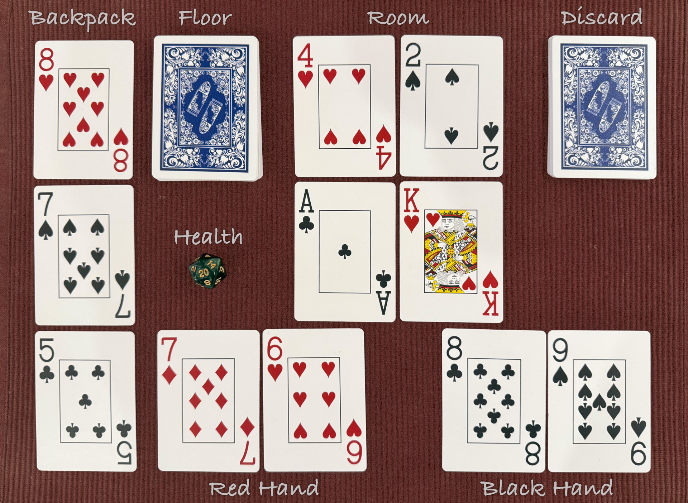

# Keevorn

Keevorn is a solo dungeon crawler you can play with a standard deck of cards and two Jokers. All you need is a deck, something to track health, and a bit of table space.

## How to play

- [Rulebook (PDF)](documents/keevorn_rulebook.pdf?raw=true)

## See also

- [Announcement thread (Reddit)](https://www.reddit.com/r/soloboardgaming/comments/1pouxx7/keevorn_a_solo_dungeon_crawler_for_a_standard/)
- [Keevorn on BGG (BoardGameGeek)](https://boardgamegeek.com/boardgame/460622/keevorn)

---

Keevorn · 2nd Revision, December 2025 · MIT License · [github.com/JanuszPelc/Keevorn](https://github.com/JanuszPelc/Keevorn)