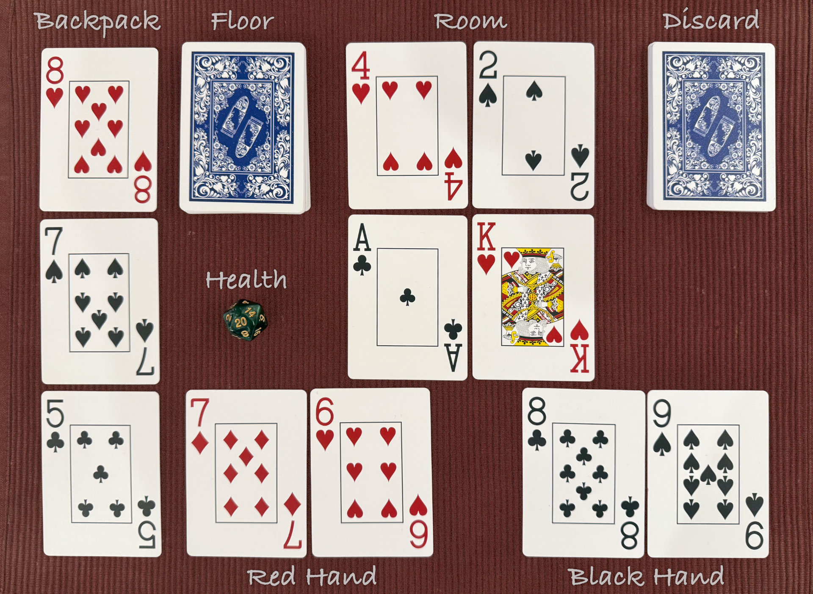

# Keevorn

Keevorn is a solo dungeon crawler you play with a standard deck of cards and two Jokers. All you need is a deck, something to track health, and a bit of table space.

## How to play

- [Download the rulebook (PDF)](https://raw.githubusercontent.com/JanuszPelc/Keevorn/master/documents/keevorn_rulebook.pdf)

## See also

- [Keevorn on BGG (BoardGameGeek)](https://boardgamegeek.com/boardgame/460622/keevorn)

---

Keevorn · 2nd Revision, December 2025 · MIT License · [github.com/JanuszPelc/Keevorn](https://github.com/JanuszPelc/Keevorn)